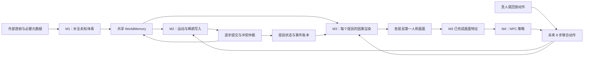

# PLOT 代码与项目逻辑说明

本文面向第一次接触 PLOT 代码的审阅者。它解释项目要解决的问题、M1–M4 如何协作、
数据和状态如何流动、核心代码放在哪里，以及当前实现与实验设想之间的边界。训练部署请看
仓库根目录的 [`README.md`](README.md)。

## 1. 项目解决什么问题

PLOT 是一个多居民、可编辑体素世界模型。它不仅要生成看起来合理的视频，还需要显式处理：

1. 玩家或 NPC 修改了哪个方块；
2. 攻击命中了哪个居民、血量如何变化；
3. 这些结果如何写入同一份共享状态；
4. 其他居民之后如何从自己的视角看到并继续使用这些结果；
5. NPC 不在真人画面里时，是否仍能观察、行动并影响世界。

因此项目把“生成画面”和“修改世界状态”分开。视频历史不是唯一记忆；世界中已经建立的
体素、居民状态和交互结果由共享状态保存。

## 2. 整体结构



四个编号的含义固定：

| 模块 | 责任 | 不负责 |
|---|---|---|
| M1 Fill | 只为从未建立过的体素生成初值 | 不处理挖掘、放置或攻击 |
| M2 Write/Transition | 预测运动、交互目标和 typed payload | 不直接生成 RGB |
| M3 Renderer | 从已提交状态生成各居民第一人称画面 | 不直接决定 authoritative write |
| M4 Policy | 根据自己的已完成观察产生 NPC 动作 | 不绕过 M2 直接修改世界 |

训练时四个模型分别训练；闭环推理时再按固定顺序连接。

## 3. 核心状态契约

### 3.1 世界记忆

[`plot/world_memory.py`](plot/world_memory.py) 实现无界稀疏体素记忆。底层使用固定大小
dense chunk，但 API 使用全局整数坐标。

```text
WorldMemory
├── block_ids：模型词表中的方块类别
└── known：该坐标是否已经建立
```

`unknown` 与 `air` 不同：未知位置的 `known=False`；空气是一个已经建立的普通 block 类别。
M1 默认只能填 `known=False` 的位置，M2 的显式写事件才允许覆盖已知位置。

### 3.2 居民和写事件

[`plot/transition_state.py`](plot/transition_state.py) 定义：

- `CharRow`：位置、yaw/pitch、HP、手持物、居民类型和相机相对状态；
- `WriteEvent`：transition、顺序、source、target kind、target 和 payload。

体素写的 payload 是新 block id；居民写的 payload 是 HP 变化。无效攻击、普通移动和没有
产生世界效果的动作对应 null，而不是伪造一次成功写入。

### 3.3 时间对齐

公共 episode 保持连续格式：

```text
observations:  o0, o1, ..., oT       共 T+1 个
actions:       a0, a1, ..., a(T-1)   共 T 个
transition t:  ot -> at -> event/state(t+1) -> o(t+1)
```

48³、13³、65 帧上下文和 8 帧块都由训练 adapter 派生，不要求采集数据预先切块。

## 4. 仓库分层

```text
Plot/
├── plot/data/          连续 episode 到各模型训练样本的适配器
├── plot/models/        M1–M4 网络与共享组件
├── plot/training/      loss、训练 step、rollout 和监控逻辑
├── plot/pipelines/     世界记忆、提交、渲染和闭环编排
├── train_scripts/      可执行训练入口与正式/实验 recipe
├── experiments/m1/    当前 M1 flow 基线及受控替代实验
├── dataset_toolkits/   可重建索引和训练缓存生成器
├── scripts/            下载、校验、环境检查和运维工具
├── derived/            可迁移词表和小型索引，不是原始数据
├── checkpoints/        固定上游权重及其 manifest
└── tests/              CPU contract test 与可选 CUDA test
```

依赖方向原则是：模型层不反向 import 训练脚本或实验入口；训练脚本负责组装 dataset、model、
optimizer 和分布式运行。

## 5. M1：建立未知世界内容

论文语义中的 M1 是 Fill Network。基础实现位于：

- [`plot/models/fill.py`](plot/models/fill.py)：fill classifier；
- [`plot/data/fill_dataset.py`](plot/data/fill_dataset.py)：48³ 目标、相机和视觉证据；
- [`plot/pipelines/plot_pipeline.py`](plot/pipelines/plot_pipeline.py)：只提交未知体素；
- [`plot/training/fill_trainer.py`](plot/training/fill_trainer.py)：mask 内分类 loss。

`PlotPipeline.fill_resident_windows` 让多个居民窗口从同一个已提交快照提出候选；重叠坐标按
置信度选一个结果，再一次性写入共享记忆，避免某个居民先写导致后续居民读取到不同输入。

仓库还保留 `experiments/m1/` 下的 multiview/PERSIST flow 主基线，以及 geometry bootstrap、
projective fill 等替代路径。它们用于当前 M1 效果研究，不能与 `FillNetwork` 脚本混称为同一个
checkpoint 架构。审阅实验结果时必须同时记录具体入口、配置和 checkpoint。

## 6. M2：运动和 target-addressed write

核心文件：

- [`plot/models/transition.py`](plot/models/transition.py)：8 步时间/居民注意力、运动分支、
  ordered edit/attack query 和 typed heads；
- [`plot/data/transition_dataset.py`](plot/data/transition_dataset.py)：13³ 局部状态、联合动作和
  事件标签；
- [`plot/training/transition_trainer.py`](plot/training/transition_trainer.py)：运动、地址、时间、
  payload 和 null loss；
- [`plot/pipelines/transition_pipeline.py`](plot/pipelines/transition_pipeline.py)：稳定 slot 顺序
  提交以及冲突处理；
- [`train_scripts/train_transition_full.py`](train_scripts/train_transition_full.py)：训练入口。

M2 一次看到完整 8 步联合动作，所以块内 query 使用双向注意力，不使用 KV cache。网络先获得
运动学 proposal，再预测 residual；交互分支预测发生次数、时间、目标和 payload。预测阶段的
所有 query 读取同一个块边界状态，提交阶段才按 transition 和 slot 顺序修改状态。

当前实现的重要限制：M2 视觉支路仍是小 CNN，而不是最终冻结的 M3/VAE feature；复杂 HP
恢复、同帧多来源伤害和通用库存变化仍有监督歧义。这些限制必须在审阅结论中单独注明。

## 7. M3：从共享状态生成第一人称视频

核心文件：

- [`plot/data/renderer_dataset.py`](plot/data/renderer_dataset.py)：65 帧窗口、48³ shared crop、
  resident 条件、RGB 和仅用于 loss 的实例 mask；
- [`plot/models/renderer.py`](plot/models/renderer.py)：条件编码和 M3 顶层结构；
- [`plot/models/renderer_backbone/`](plot/models/renderer_backbone/)：Pixel DiT、因果注意力、
  KV cache、体素投影和 player 条件；
- [`plot/models/renderer_codec.py`](plot/models/renderer_codec.py)：冻结 Pixel VAE；
- [`plot/training/renderer_trainer.py`](plot/training/renderer_trainer.py)：flow、像素、边缘、
  identity/counterfactual loss 和 8 帧 rollout；
- [`train_scripts/train_renderer.py`](train_scripts/train_renderer.py)：DDP、W&B、验证和 checkpoint；
- [`plot/pipelines/renderer_pipeline.py`](plot/pipelines/renderer_pipeline.py)：每步已提交状态快照；
- [`train_scripts/recipes/m3/`](train_scripts/recipes/m3/)：正式入口和外观实验 recipe。

训练样本为一张已知前缀帧加 64 张未来帧。模型是因果 Pixel DiT；部署时每次生成 8 帧，
随后把完成帧提交进 KV cache，连续执行八次得到 64 帧 rollout。体素首先投影到目标相机，
居民状态和外观也按目标视角编码。每个 target resident 单独生成画面，但读取的是同一份已提交
世界状态。

实例 mask、player mask 和 attachment map 是 loss/诊断信号，不是推理条件。chunk8 NPZ 只是
数据加载缓存，也不是网络的 8 帧生成块；两者恰好都取 8 是为了当前访问局部性。

M3 同时保留多种外观实验开关，包括旧的 view-aware dense path、reference attention、统一
reference token、几何感知 reference 和多 block reinjection。`RendererArgs` 会拒绝互相冲突的
路径。审阅 checkpoint 时必须读取它旁边的 `config.json`，不能仅凭目录名猜架构。

## 8. M4：读取 M3 特征的 NPC 策略

核心文件：

- [`plot/models/inserted_policy.py`](plot/models/inserted_policy.py)：插入 M3 后部 block 的只读
  policy token；
- [`plot/models/structured_action.py`](plot/models/structured_action.py)：按键、hotbar 和鼠标 head；
- [`plot/data/inserted_policy_dataset.py`](plot/data/inserted_policy_dataset.py)：8 帧历史到未来
  8 步动作；
- [`plot/policy_schema.py`](plot/policy_schema.py)：builder/villager/combat family 与 profile；
- [`train_scripts/train_policy.py`](train_scripts/train_policy.py)：冻结 M3 后训练 M4；

M4 读取最近 8 张已经完成的目标居民画面特征和 incoming action，一次预测未来 8 步。M3 参数
冻结，video patch 只作为 K/V，M4 loss 不回传到渲染 token。builder、villager、combat 使用
独立参数族；profile 在族内区分和平村民、僵尸、骷髅和守卫等行为。

## 9. 闭环执行顺序

[`plot/pipelines/closed_loop_pipeline.py`](plot/pipelines/closed_loop_pipeline.py) 是理解完整系统
最重要的代码入口。每个 8 步 block 的 authoritative 顺序是：

1. M4 为模型控制的居民生成动作；真人或 action-replay 槽位使用外部动作；
2. M2 读取块边界状态和全部联合动作，预测 8 步运动及稀疏写；
3. `TransitionCommitter` 逐 transition、按稳定 slot 顺序提交写入并产生状态快照；
4. 每一步提交后，若居民新窗口包含 unknown，M1 只补这些位置；
5. `RendererMemoryBlock` 从已提交状态建立对应帧的 M3 条件；
6. M3 因果生成 8 张新画面并提交 KV cache；
7. M3 后部空间 feature 成为下一轮 M4 的只读视觉输入。

首帧不足以形成 M4 的 8 帧历史，因此第一块动作必须由外部提供；从第二块开始 M4 才能闭环。

## 10. 训练数据如何进入各模块

| 原始字段 | M1 | M2 | M3 | M4 |
|---|---|---|---|---|
| RGB/相机 | 视觉证据 | 边界视觉特征 | RGB target 与相机条件 | 冻结 M3 feature |
| 49³ voxel + center | block target | 派生 13³ state | 派生 48³ state | 不直接读取 |
| pose/HP/item | 可见性/几何 | 状态与监督 | resident 条件 | 经 M3 feature/observable |
| joint action | 不使用 | 主要条件 | target action 条件 | history 与 imitation target |
| block/damage event | 不使用 | 地址和 payload 标签 | event cue/诊断 | 间接反映在观察中 |
| uint16 instance mask | 不作为输入 | 不作为输入 | 区域 loss/诊断 | 不作为输入 |
| builder task text | 不使用 | 不使用 | 不使用 | builder 条件 |

原始 release 始终保持模型无关。`dataset_toolkits/` 生成的索引和 cache 都应该可重建；不得为了
某个模型修改公共 episode。

## 11. 当前完成度与不能过度声称的内容

已经有代码和 contract test 的部分：

- unknown 与 air 分离的无界共享体素记忆；
- M1 只填未知位置；
- M2 typed write 和稳定提交顺序；
- M3 因果 mask、8 帧生成、KV commit、状态投影与多居民条件；
- M4 只读 M3 feature、family/profile 路由和结构化 8 步动作；
- M4 → M2 → commit/M1 → M3 的闭环编排；
- DDP、checkpoint staging、W&B、portable index 和可选 chunk8 loader。

仍需用正式 checkpoint/评测证明的部分：

- 长 rollout 中状态和视频是否持续正确；
- M2 的攻击/多事件和完整库存语义；
- 当前 M1 实验路径与论文 Fill 接口的最终统一；
- M3 人物清晰度、外观绑定和各外观分支的最终取舍；
- M4 在生成画面上的闭环任务成功率；
- 论文表格中的外部基线、消融和数值结果。

换言之，pipeline 能运行不等于所有论文主张已经被实验验证。代码审阅应把接口正确性、训练
可执行性和经验效果分开评价。

## 12. 推荐审阅顺序

1. 根目录 [`README.md`](README.md)：如何准备和启动标准 M3；
2. 本文：建立总体心智模型；
3. `transition_state.py`、`world_memory.py`：状态定义；
4. `closed_loop_pipeline.py`：模块调用和提交顺序；
5. 四个 `plot/data/*dataset.py`：训练标签究竟来自哪里；
6. `plot/models/fill.py`、`transition.py`、`renderer.py`、`inserted_policy.py`：网络；
7. `plot/training/`：loss 与 rollout；
8. `train_scripts/` 和 recipe：运行配置；
9. `tests/`：哪些行为由 contract test 保证；
10. checkpoint 旁的 `config.json` 和运行 manifest：某次具体实验做了什么。

建议审阅者重点检查：时间是否错一帧、训练条件是否泄漏未来、mask 是否误作推理输入、不同
居民是否真的读取同一状态、M2 写入是否在 M3 渲染前提交、resume/warm-start 是否与架构匹配、
以及实验指标是否超出了当前代码和数据能够支持的结论。

## 13. 最小验证

不使用 GPU 的核心测试：

```bash
.venv/bin/python -m pytest -q tests
```

M3 B200 环境和 checkpoint I/O 检查：

```bash
python scripts/check_m3_environment.py \
  --device cuda:0 \
  --output-dir /fast/outputs/plot_environment_check \
  --checkpoint-staging-dir /fast/checkpoints/plot
```

正式运行前还应执行根 README 中的 batch 4/2/1 调优和两步多卡 smoke test。
