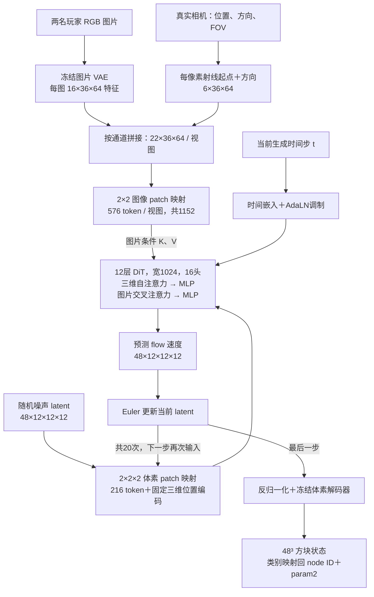

# 当前 M1 基线：多人 PERSIST flow

按用户要求，后续架构修改以原 flow 为基线。直接预测仅保留为对照实验，不作为当前主线。
现有共享入口的默认 objective 已是 flow，无需删除 direct 分支或覆盖历史权重。

- 模型：`experiments/m1/multiview_voxel_dit.py`。
- 训练：`experiments/m1/train_multiview_persist_full.py --objective flow`。
- 基线权重：`outputs/m1_multiview_persist_gtcam_s01_all_v1/checkpoint_latest.pt`，全量 flow 第20轮。
- 明确续训入口：`experiments/m1/recipes/flow_baseline.sh`，默认从该权重和优化器继续到第30轮，独立输出目录。此次切回没有启动额外训练。
- 保持两名玩家图片＋GT相机输入，无相机预测、无 mask 监督、无场景 ID。

## 推理结构



图中的 216 个 token 对应 6³ patch 网格，每个 token 覆盖 latent 中2³位置；
最终恢复12³ latent，再由解码器恢复48³方块。模型可训练参数约457,619,840。
图片射线依附于每张图，玩家 token 合并后作为同一个3D场景的条件，不各自生成一个独立场景。
有效视图标记仅用于屏蔽缺失输入，不是图像分割 mask 监督。

## 训练与推理的区别

训练时，冻结体素编码器把真实方块压成归一化干净 latent z0；采样高斯噪声 ε 和时间 t：

```text
z_t = (1-t) z0 + [1e-5 + (1-1e-5)t] ε
目标速度 v* = (1-1e-5) ε - z0
loss = mean((DiT(z_t, t, 图片与射线) - v*)²)
```

每个训练样本只采一个时间并前向一次，不把20步推理全部展开反传。
推理从纯噪声起步，按已有重映射时间表执行20次 Euler 更新，不输入 GT latent。
体素解码器输出2138个PERSIST状态类别；现有几何评分主要映射为raw node ID比较。

## 目前的空间对应机制

相机被转换为射线特征，随图片特征进入交叉注意力。三维 token 查询所有有效图片 token。
当前没有显式将体素位置投影到像素，也没有遮挡判断模块；空间对应依靠网络学习。
后续改动优先围绕这条条件连接做可控对照，保留 flow 作为生成目标。

直接预测对照与本基线共享 Transformer 主体，区别在固定零 latent、固定t=0、干净latent回归，
而非另一套更深或更大的网络。选择回到flow不代表它已达到全量90%重建目标。
