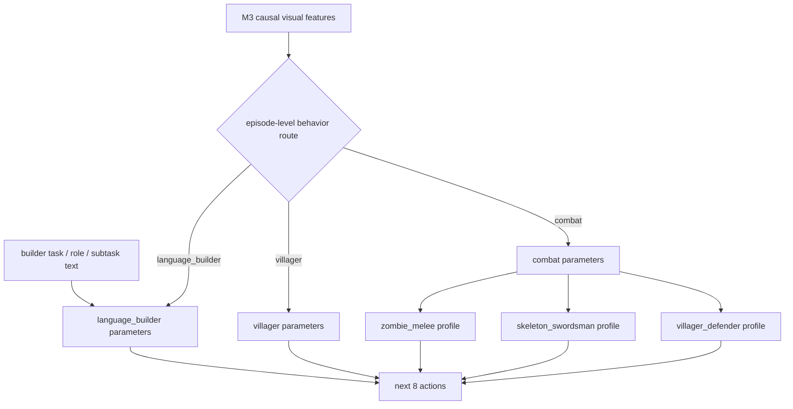

# M4 居民策略架构

> 当前方案，2026-09-10。完整系统与数据口径见 [method.md](method.md)。

## 1. 接口

```text
PolicyFamily(
    own_last_8_completed_latents,
    corresponding_M3_conditions,
    profile,
    shared_text,
    current_text
) -> next_8_actions
```

动作统一为23维语义按键与鼠标表示。M4 不读取49³体素、全局 memory、其他居民真值状态、
整数 crop center 或审计生成的行为文字。M4 与 M3 耦合在特征层：actor token 可以读取 M3
后四层的完整空间特征，但渲染 token 不能读取 actor token。每次完整执行输出的8步后再调用
一次 M4，不做每帧重规划。

M3 参数全部冻结。每个后四层插入块依次执行：actor token 对本帧全部 M3 spatial patch 的
cross-attention、8帧 causal temporal attention、对 frozen T5 current text 的
cross-attention 和 MLP。M4 不使用 KV cache；需要 cache 的是因果 M3。

## 2. 参数族与 Profile



- `language_builder`：单独参数和文字编码器，允许移动、跳跃、选物、挖放。
- `villager`：和平村民参数，只允许移动、转向、跳跃和等待；遇到 hostile 时逃跑。
- `combat`：僵尸、持剑骷髅和防守村民共享参数，通过 Profile 调制。
- `zombie_melee` 直接贴近；`skeleton_swordsman` 横移且过近后退；`villager_defender` 围绕
  守卫区拦截并返回。

路由按行为能力而非 mesh：同为村民外观，peaceful 使用 villager 参数，defender 使用 combat；
僵尸和骷髅外观不同，但共享 combat。

## 3. 数据字段

公共数据只需 episode 级：

```json
{
  "agent_kinds": {"agent2": "npc_villager"},
  "behavior_routes": {
    "agent2": {"family": "villager", "profile": "villager_peaceful"}
  }
}
```

这些字段用于审计和后处理路由，不在每帧重复。逐帧训练监督来自实际 action、第一人称 RGB、
最小角色状态及可用文字区间。`agent_id` 只是槽位，必须通过 slot permutation 防止身份泄漏。

## 4. 时间训练

原始 episode 不预切8帧。后处理为每个因果锚点取最近8个已完成画面，目标是未来8步动作。
目标不能跨越 episode 末尾或无效策略区间。输入是 `o[t-7:t+1]` 及产生它们的
`a[t-8:t]`，监督目标是 `a[t:t+8]`；训练时不能读取目标动作对应的未来画面。
intentional wait 是有效动作监督，不因全零而删除。

动作头沿用原版结构：10个兼容按键独立 BCE，hotbar 为 none+1--9 的单一 categorical，
水平与垂直鼠标分别为17档 categorical。最后一个 actor token 一次输出完整8步 chunk。

## 5. 外观和种类

每个 player-shaped resident 都有正/背/左/右四张外观图。僵尸、骷髅使用相同数据接口但不同
mesh、纹理和动画；骷髅固定剑，僵尸可用剑或斧。held item 是状态条件，武器纹理不单独输入。
实例 mask 只用于监督和评测。

## 6. 训练与验收

分别报告每个 family/profile 的 horizon 1--8 动作指标、非法动作率和闭环后果。额外检查：

- peaceful villager 的 dig/place/attack 必须为零；
- zombie/skeleton 的目标选择、接敌延迟和命中率；
- builder 的文字消融与错配文字；
- 固定观察只切换 Profile 时，动作分布应改变；
- 同步交换 slot 后，输出也应同步交换；
- M4 生成动作放回同一初态的引擎重放，验证真实可执行性。

完全共享策略与三个完整独立网络都作为消融。默认使用三个能力参数族；只有观测到负迁移时
才在族内增加小 adapter/LoRA。
